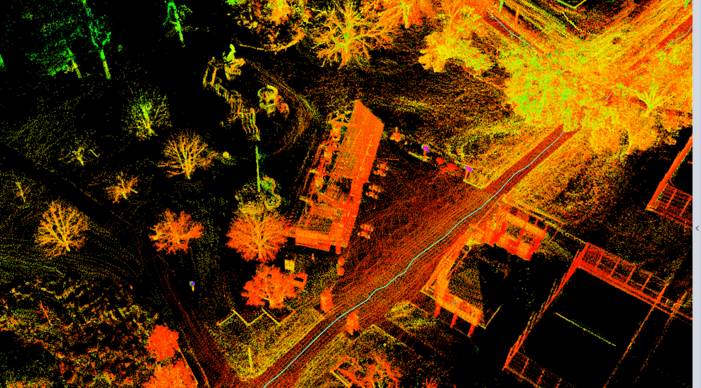

LIO-SAM是Tixiao Shan小哥在其Lego-Loam的基础上，增加了多传感器融合（lidar、9-axis IMU、GPS）的又一开源框架，原始仓库[here](https://github.com/TixiaoShan/LIO-SAM)。
## 1、系统结构

    

LIO-SAM维护了两个因子图，运行速度比实时快4倍!
- "mapOptimization.cpp"模块优化雷达里程计与GPS因子，此因子图在整个运行过程中持续维护。
- "imuPreintegration.cpp"模块优化IMU与雷达里程计因子并且估计IMU的bias。此因子图定期复位，保证IMU频率下的实时位姿估计。

## 2、激光点云格式要求

激光雷达在"imageProjection.cpp"模块去畸变，它对点云格式有这两点需求：

- **提供点云中每个激光点的时间戳。**LIO-SAM使用IMU数据来去除激光点云畸变，因此需要知道一帧扫描中(Scan)激光点的相对时间。"deskewPoint()"函数中使用这个相对时间获取该点相对于Scan起始时刻的位姿变换。例如lidar的频率是10Hz，则激光点的时间戳应在0~0.1s范围内。

- **提供点云中每个激光点的ring number。**LIO-SAM使用的是有序的点云，其使用这个信息在矩阵中正确地组织点云。

## 3、IMU数据格式要求

- 如原始的LOAM一般，LIO-SAM仅支持可提供roll、pitch和yaw角估计的9轴的IMU！其中，roll和pitch角主要用于使系统处于正确的姿态；当使用GPS数据时yaw角用来初始化系统的朝向。系统的性能在很大程度上取决于IMU测量的质量。IMU采样频率越高，系统精度越高。LIO-SAM推荐使用频率至少为200Hz的九轴IMU。

- LIO-SAM将IMU的测量投影到Lidar坐标系下！坐标系统一后，效果如下图，也可以看作者Debug时的视频[here (link to YouTube)](https://youtu.be/BOUK8LYQhHs)。

    

## 4、样例数据集

作者提供了众多数据集，百度网盘限制上传4G文件，我转存了其中之一：  
**Park dataset**：https://pan.baidu.com/s/1IRjuGBo0ljgx_FnBXSfNHw   
**提取码**：kdj8，此数据集运行效果如图: 

    

